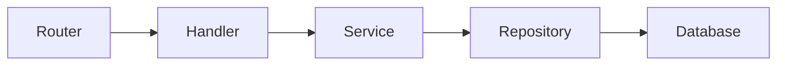
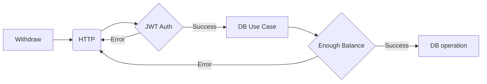

### Layer Design https://github.com/mermaid-js/mermaid
Api(Golang) Layer Design

```mermaid
  flowchart LR;
      Router-->Handler-->Service-->Repository-->Database;
```

Wallet Withdraw Diagram

```mermaid
flowchart LR

A[Withdraw] --> B(HTTP)
B --> C{JWT Auth}
C -->|Success| D[DB Use Case]
C -->|Error| B
D -->F{Enough Balance}
F -->|Success| H[DB operation] 
F -->|Error| B 
```
