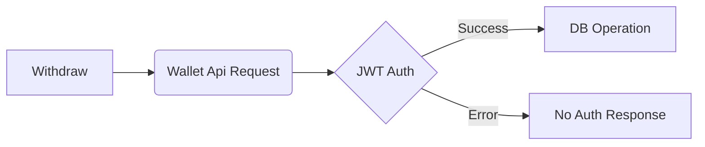

### Entegrasyon Dökümanı
Trendyol https://developers.trendyol.com/tr
HepsiBurada https://developers.hepsiburada.com/?docs=dokuman/baslangic
Getir 
- https://locals-integration-api-gateway.artisandev.getirapi.com/swagger-ui/index.html?configUrl=/v3/api-docs/swagger-config#/
- https://docs.google.com/document/d/1jOFtumyLhxFn78lSxBkS7nP45k7gFVgPLsvTWe1lvmw/edit#heading=h.xb55hwmmf2kx

### System Design https://github.com/mermaid-js/mermaid
Api(Golang) Layer Design

Otomasyon
- Cronjobla günlük platform apilerine istek göndererek veri depola,

